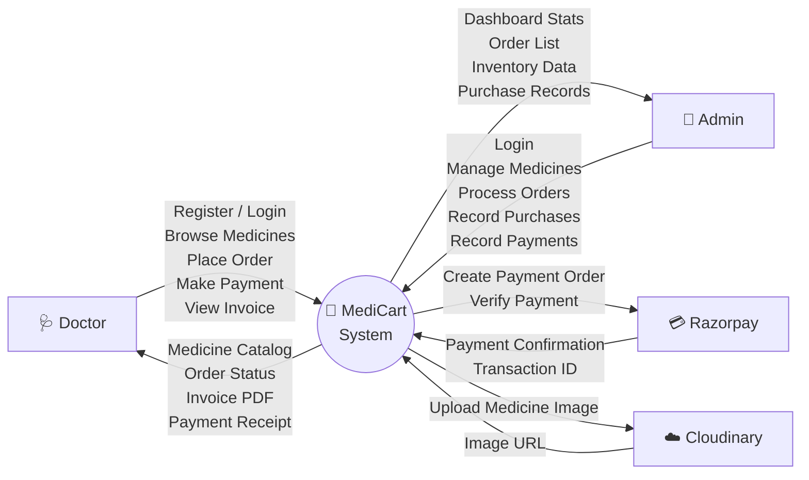
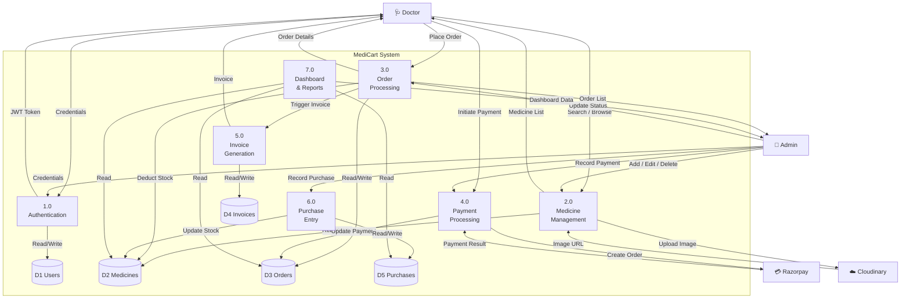
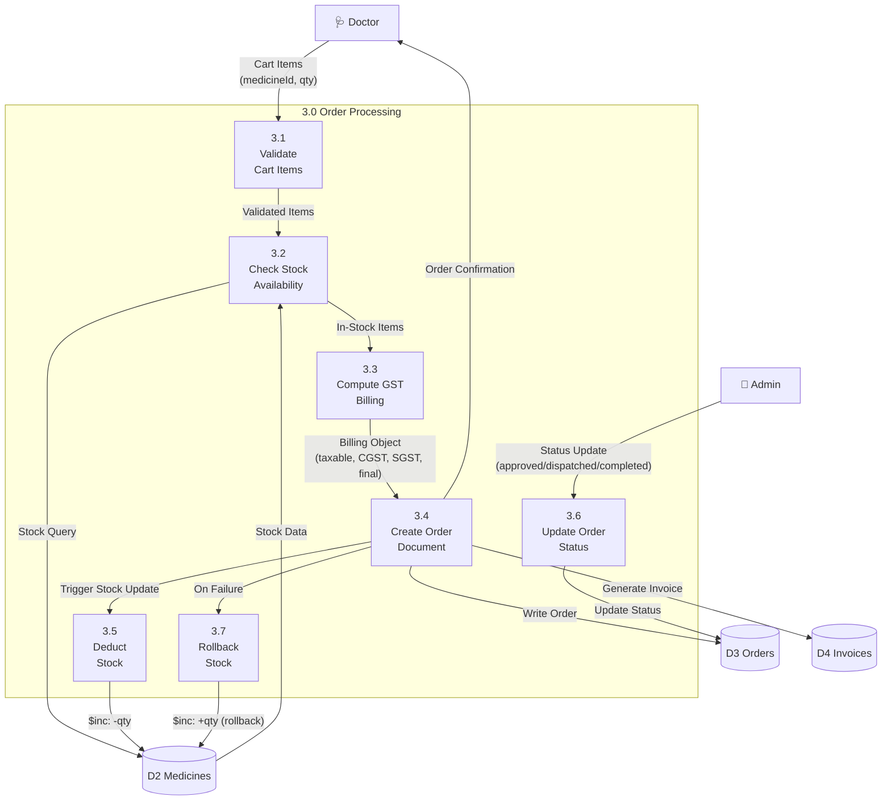
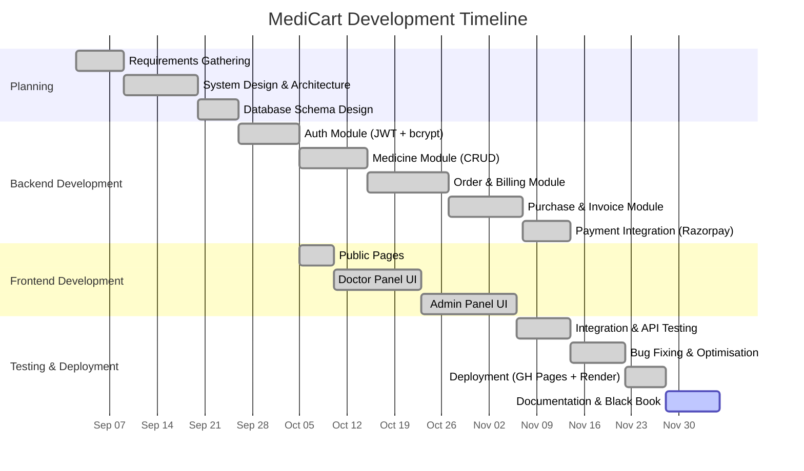
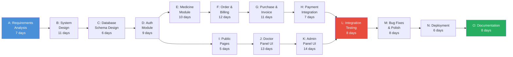

# MediCart — Complete Black Book Report
## A B2B Medical Ordering and Inventory Management System

---

# CHAPTER 1: INTRODUCTION

## 1.1 Background

The pharmaceutical supply chain sector in India generates over ₹2 lakh crore in annual revenue, yet the Business-to-Business (B2B) procurement process between distributors and independent clinics or hospitals remains plagued with antiquated methods. Most medical practitioners still rely on telephone calls, WhatsApp messages, handwritten prescriptions, and paper-based invoices to place orders with their distributors. This leads to frequent misunderstandings about medicine variants, dosage forms, and packaging sizes.

**MediCart** is a comprehensive web-based B2B Medical Ordering and Inventory Management System designed to bridge this gap between pharmaceutical distributors (Admins) and healthcare practitioners (Doctors/Clinics). Built on the modern MERN stack (MongoDB, Express.js, React.js, Node.js), MediCart digitises and streamlines the entire workflow — from catalogue browsing and ordering, to GST-compliant invoice generation and real-time inventory tracking.

The system draws inspiration from contemporary B2C e-commerce platforms but is purpose-built for the regulatory requirements and operational nuances of pharmaceutical distribution, including GST bifurcation (CGST + SGST), batch tracking, credit-based payment models, and purchase-entry bookkeeping.

## 1.2 Objectives

The primary objectives driving the development of MediCart are:

1. **Digitisation of Orders:** Transition the medical product ordering process from manual phone/paper-based systems to a secure, centralised digital platform accessible 24/7 from any modern browser.
2. **Real-Time Inventory Management:** Provide administrators with accurate, live tracking of medicine stock levels, automatically syncing inventory upon order placement and purchase entries — thus preventing stockouts and overstocking.
3. **Automated GST-Compliant Billing:** Automatically compute taxable amounts, CGST, SGST, and generate structured electronic invoices for every transaction, eliminating manual calculation errors.
4. **Secure Payment Processing:** Integrate multiple payment modes — Razorpay for online payments, Cash on Delivery (COD), and Credit-based (pay later) — to accommodate diverse business relationships.
5. **Role-Based Access Control:** Implement strict functional separation between Doctors (buyers) and Administrators (sellers/managers) using JWT-based authentication and route-level middleware guards.
6. **Comprehensive Purchase Entry Tracking:** Enable distributors to record wholesale purchase entries from manufacturers, automatically updating the global inventory and tracking HSN codes, batch numbers, scheme percentages, and GST brackets.

## 1.3 Purpose, Scope, and Applicability

### 1.3.1 Purpose

The purpose of MediCart is to provide a unified, transparent, and structured platform that standardises the interaction between medical suppliers and healthcare practitioners. Specifically, it aims to:

- Eliminate transcription errors inherent in telephonic ordering.
- Provide real-time stock visibility to doctors before placing orders.
- Automate invoice generation with correct GST partitioning.
- Digitise the distributor's purchase ledger from manufacturers.
- Offer analytical dashboards for business intelligence.

### 1.3.2 Scope

The scope of MediCart encompasses the following functional modules:

- **Doctor Module:** User registration and authentication, medicine catalogue browsing with search and category filters, shopping cart management with real-time GST computation, secure checkout (Online/COD/Credit), order history tracking, and invoice viewing/downloading.
- **Admin Module:** Secure admin login, interactive dashboard analytics (total sales, stock alerts, order counts), comprehensive medicine database management (CRUD operations with Cloudinary image uploads), order processing workflows (status transitions: Placed → Approved → Dispatched → Completed), purchase entry recording from manufacturers, payment entry reconciliation, and inventory management.
- **Technical Scope:** The system is accessible via modern web browsers (Chrome, Firefox, Edge, Safari) and features a responsive design for mobile devices. Frontend is hosted on GitHub Pages; backend is deployed on Render.com with MongoDB Atlas for cloud database hosting.

### 1.3.3 Applicability

MediCart is applicable to:

- **Pharmaceutical distributors** seeking to digitise their ordering and inventory management processes.
- **Independent clinics, hospitals, and medical practitioners** who procure medicines in bulk from distributors.
- **Small-to-medium medical supply chains** that require GST-compliant invoicing and financial tracking without expensive ERP solutions.
- **Educational institutions** as a reference implementation of a full-stack MERN application with real-world business logic.

## 1.4 Achievements

The following milestones were successfully achieved during the development of MediCart:

1. **Fully Functional B2B Platform:** A complete, production-ready web application enabling end-to-end medicine ordering, from catalogue browsing to invoice download.
2. **Integrated Payment Gateway:** Successful integration of Razorpay payment gateway with signature verification for secure online transactions.
3. **Cloud-Native Architecture:** Deployment across GitHub Pages (frontend), Render.com (backend), MongoDB Atlas (database), and Cloudinary (image CDN) — demonstrating a modern serverless-oriented architecture.
4. **Automated GST Engine:** A backend billing engine that automatically bifurcates GST into CGST and SGST with floating-point precision, generating compliant invoices.
5. **Atomic Stock Management:** Implementation of MongoDB's `findOneAndUpdate` with `$inc` operators for race-condition-safe stock deduction, with automatic rollback on order failure.
6. **Comprehensive Purchase Entry System:** A detailed purchase entry module capturing batch numbers, HSN codes, manufacturer details, scheme percentages, and discount structures — mirroring real-world pharmaceutical purchase bills.

## 1.5 Organisation of Report

This report is organised into seven chapters, each addressing a distinct phase of the Software Development Life Cycle:

| Chapter | Title | Description |
|:--------|:------|:------------|
| **1** | Introduction | Background, objectives, scope, and achievements of the project |
| **2** | Survey of Technologies | Overview and comparison of technologies used in MediCart |
| **3** | Requirements and Analysis | Problem definition, functional/non-functional requirements, planning, scheduling, and cost estimation |
| **4** | System Design | Data design, procedural design (UML diagrams), UI design, security issues, and test cases |
| **5** | Implementation and Testing | Coding details, code efficiency analysis, testing approaches, and test results |
| **6** | Results and Discussion | Test reports, system performance metrics, and user documentation |
| **7** | Conclusions | Significance, limitations, and future scope of the project |

Additional sections include References, a Glossary of technical terms, and Appendices containing supplementary material.

---

# CHAPTER 2: SURVEY OF TECHNOLOGIES

## 2.1 Overview

MediCart leverages a carefully curated stack of modern web technologies, each selected for its maturity, community support, performance characteristics, and suitability for building data-intensive, real-time web applications. The following sections provide a detailed survey of each technology and its role in the system.

## 2.2 Technologies Used

### 2.2.1 React.js (Frontend Framework)

React.js (v18.2) is an open-source JavaScript library maintained by Meta (Facebook) for building user interfaces through a component-based architecture. MediCart's frontend is built as a Single Page Application (SPA) using React, with **Vite (v7.2)** as the build tool for near-instant hot module replacement and optimised production builds. Key React features employed include:

- **Context API:** `AuthContext` manages JWT tokens, user roles, and authentication state globally. `CartContext` manages shopping cart state with real-time GST recalculation.
- **React Router (v6.27):** Client-side routing for seamless navigation without page reloads.
- **Framer Motion (v12.23):** Physics-based animation library for smooth page transitions, hover effects, and micro-interactions.
- **Lucide React (v0.556):** Modern icon library providing consistent, customisable SVG icons throughout the UI.

### 2.2.2 Node.js (Runtime Environment)

Node.js (v18.x) is a server-side JavaScript runtime built on Chrome's V8 engine. It enables JavaScript execution on the server, providing a unified language across the entire MediCart stack. Node.js's event-driven, non-blocking I/O model makes it ideal for handling multiple concurrent API requests from doctors and administrators simultaneously without thread-blocking.

### 2.2.3 Express.js (Backend Framework)

Express.js (v4.18) is a minimal, fast, and unopinionated web framework for Node.js. MediCart uses Express for:

- RESTful API route definition across 10 route files (authentication, medicines, orders, purchases, payments, invoices).
- Middleware chaining: CORS configuration, JSON body parsing, Morgan HTTP logging, JWT authentication verification, and role-based access control.
- Error handling via a centralised `errorHandler` middleware.

### 2.2.4 MongoDB (NoSQL Database)

MongoDB is a document-oriented NoSQL database that stores data in flexible, JSON-like BSON documents. MediCart uses **MongoDB Atlas** (cloud-hosted) for production deployment and **Mongoose (v8.1)** as the Object Data Modelling (ODM) library. The database contains five primary collections:

- `users` — Doctor and Admin accounts
- `medicines` — Product catalogue with pricing, stock, and images
- `orders` — Transaction records with embedded billing data
- `invoices` — GST-compliant invoice documents
- `purchases` — Wholesale purchase entries from manufacturers

### 2.2.5 Razorpay (Payment Gateway)

Razorpay (Node SDK v2.9) is an industry-standard Indian payment gateway supporting UPI, credit/debit cards, net banking, and wallets. MediCart integrates Razorpay for secure, encrypted online payment processing during checkout, with server-side signature verification to prevent payment tampering.

### 2.2.6 Cloudinary (Image CDN)

Cloudinary (v2.8) is a cloud-based image and video management platform. MediCart uses Cloudinary to:

- Store medicine product images uploaded by admins.
- Serve optimised images globally via CDN, reducing backend server load.
- Handle automatic format conversion and responsive image delivery.

### 2.2.7 Security Technologies

- **JSON Web Tokens (jsonwebtoken v9.0):** Stateless, token-based authentication. Tokens encode user ID and role, expire after 7 days, and must be attached to the `Authorization` header for protected API routes.
- **bcryptjs (v2.4):** Cryptographic password hashing with salt rounds (factor 10) via Mongoose pre-save hooks — passwords are never stored in plain text.
- **crypto (v1.0):** Used for generating secure random strings for payment verification signatures.

### 2.2.8 Additional Technologies

- **Multer (v2.0):** Middleware for handling `multipart/form-data` (file uploads). Processes medicine images in memory buffers before uploading to Cloudinary.
- **PDFKit (v0.17):** Server-side PDF generation library for producing downloadable invoice documents.
- **Morgan (v1.10):** HTTP request logger middleware for development/debugging purposes.
- **Axios (v1.13):** Promise-based HTTP client used in the React frontend for making API calls to the Express backend.
- **Tailwind CSS (v4.1):** Utility-first CSS framework (dev dependency) for rapid UI styling alongside custom CSS.

## 2.3 Comparison of Technologies

| Criteria | MERN Stack (Selected) | LAMP Stack (Alternative) | Django + React (Alternative) |
|:---------|:----------------------|:-------------------------|:-----------------------------|
| **Language** | JavaScript (full-stack) | PHP + JavaScript | Python + JavaScript |
| **Database** | MongoDB (NoSQL) | MySQL (Relational) | PostgreSQL (Relational) |
| **Learning Curve** | Single language across stack | Multiple languages required | Moderate (Python + JS) |
| **Real-time Support** | Excellent (Node.js event loop) | Limited (Apache thread pool) | Good (Django Channels) |
| **JSON Handling** | Native (BSON ↔ JSON) | Requires serialisation | Requires serialisation |
| **Scalability** | Horizontal (document sharding) | Vertical (table joins) | Horizontal (with effort) |
| **Ecosystem** | npm (2M+ packages) | Composer + npm | pip + npm |
| **Deployment Cost** | Low (free tiers available) | Moderate (hosting costs) | Moderate |

**Justification for MERN Stack:** The unified JavaScript ecosystem eliminates context-switching between languages, accelerates development, and enables code sharing between frontend and backend. MongoDB's flexible document model is ideal for MediCart's nested data structures (order items, purchase items, billing breakdowns), avoiding complex SQL JOINs. Node.js's non-blocking I/O efficiently handles concurrent API requests from multiple users.

## 2.4 Software Development Life Cycle (SDLC)

MediCart was developed following the **Agile SDLC** methodology with iterative sprint-based development. This approach was chosen because:

1. **Evolving Requirements:** Pharmaceutical billing logic (GST calculations, credit periods, scheme percentages) revealed complexities that required iterative refinement.
2. **Continuous Feedback:** Each sprint produced a deployable increment, allowing stakeholders to provide early feedback on workflows before full implementation.
3. **Risk Mitigation:** Critical features (authentication, payment integration) were prioritised in early sprints, reducing technical risk.

**Sprint Breakdown:**

| Sprint | Duration | Deliverables |
|:-------|:---------|:-------------|
| Sprint 1 | 2 weeks | Project setup, MongoDB schema design, JWT authentication module |
| Sprint 2 | 3 weeks | Medicine CRUD module with Cloudinary image upload |
| Sprint 3 | 3 weeks | Doctor portal: catalogue browsing, shopping cart, checkout UI |
| Sprint 4 | 3 weeks | Order processing, GST billing engine, Razorpay integration |
| Sprint 5 | 2 weeks | Purchase entry module, payment entry recording |
| Sprint 6 | 2 weeks | Invoice generation (PDFKit), admin dashboard analytics |
| Sprint 7 | 2 weeks | Integration testing, UI/UX polish, bug fixes, deployment |

## 2.5 Feasibility Analysis

### Technical Feasibility

The project is technically highly feasible. All technologies used (Node.js, React, Express, MongoDB) are industry-standard, well-documented, and have extensive community support. Cloudinary and Razorpay provide robust SDKs for Node.js and React, making image management and payment integration straightforward. The development team possesses prior experience with the MERN stack, minimising the learning curve.

### Economic Feasibility

The economic feasibility is excellent:

| Resource | Cost |
|:---------|:-----|
| Node.js, React, Express.js | Free (open-source) |
| MongoDB Atlas (M0 Free Tier) | ₹0 |
| Cloudinary (Free Tier — 25 GB) | ₹0 |
| Razorpay (per-transaction fee) | 2% + ₹3 per transaction |
| GitHub Pages (Frontend Hosting) | ₹0 |
| Render.com (Backend Hosting) | ₹0 (Free Tier) |
| Domain Name (optional) | ~₹800/year |
| VS Code, Git, Postman | Free |
| **Estimated Total Setup Cost** | **~₹800** (domain only) |

### Operational Feasibility

MediCart is operationally viable:

- **Doctor Side:** The interface mimics familiar e-commerce platforms (Flipkart/Amazon), requiring zero technical training. Doctors can browse, add to cart, and checkout intuitively.
- **Admin Side:** The dashboard provides structured forms and tables for inventory management, reducing the cognitive load compared to spreadsheet-based tracking.
- **Adoption Incentive:** Distributors benefit from reduced operational friction, eliminated manual invoice errors, and real-time financial visibility — making adoption commercially attractive.

---

# CHAPTER 3: REQUIREMENTS AND ANALYSIS

## 3.1 Problem Definition

Currently, independent medical practitioners face significant challenges when restocking their clinic dispensaries through pharmaceutical distributors:

1. **Lack of Transparency:** Doctors have no real-time visibility into the availability, current pricing, or expiry status of medicines from distributors. They must rely on sales representatives or phone calls to confirm stock.
2. **Inefficient Order Tracking:** Orders placed via phone or WhatsApp lack formal tracking mechanisms, leading to miscommunications, delayed deliveries, duplicate orders, and incorrect item fulfilment.
3. **Complex Accounting:** Distributors struggle with manual ledger entries. Calculating profit margins, applying correct GST brackets (5%, 12%, 18%), managing credit periods for multiple doctors simultaneously, and reconciling monthly accounts is highly error-prone and time-consuming.
4. **No Purchase Audit Trail:** Wholesale purchases from manufacturers are recorded in physical registers, making it difficult to trace batch numbers, verify scheme discounts, or audit HSN codes during tax filing.
5. **Manual Invoice Generation:** Creating GST-compliant invoices manually for every order requires significant administrative effort and is susceptible to arithmetic errors in tax computation.

MediCart addresses all these issues by providing a unified, digital platform that automates ordering, inventory synchronisation, billing, and purchase bookkeeping.

## 3.2 Requirements Specification

### 3.2.1 Functional Requirements

| FR ID | Requirement | Priority |
|:------|:------------|:---------|
| FR-01 | Secure registration and login for Doctors and Admins with role-based access | High |
| FR-02 | Admins can add, edit, delete, and view medicines with image uploads | High |
| FR-03 | Doctors can browse the medicine catalogue with search and category filters | High |
| FR-04 | Doctors can add medicines to a cart and adjust quantities (bounded by stock) | High |
| FR-05 | Real-time GST computation (CGST + SGST) in the cart and checkout flow | High |
| FR-06 | Support for three payment modes: Online (Razorpay), Cash on Delivery, Credit | High |
| FR-07 | Order status lifecycle: Placed → Approved → Dispatched → Completed/Cancelled | High |
| FR-08 | Automatic invoice generation upon order placement with unique invoice numbers | High |
| FR-09 | Admin dashboard with analytics: total orders, revenue, medicines count, stock alerts | Medium |
| FR-10 | Purchase entry recording: party details, items, batch, HSN code, scheme/discount % | Medium |
| FR-11 | Payment entry recording against orders | Medium |
| FR-12 | Automatic stock increment when admin records a purchase entry | High |
| FR-13 | Atomic stock deduction with rollback on order failure | High |
| FR-14 | Doctor profile management (name, email, hospital, phone, address) | Low |
| FR-15 | Deletion of out-of-stock medicines in bulk | Low |

### 3.2.2 Non-Functional Requirements

| NFR ID | Requirement | Category |
|:-------|:------------|:---------|
| NFR-01 | API endpoints must be JWT-protected; unauthorised access returns 401/403 | Security |
| NFR-02 | Passwords must be hashed using bcryptjs with salt factor 10 | Security |
| NFR-03 | Environment variables must be used for all secrets (DB URI, API keys, JWT secret) | Security |
| NFR-04 | Medicine catalogue should load in under 2 seconds on 4G networks | Performance |
| NFR-05 | Images served via Cloudinary CDN for optimised global delivery | Performance |
| NFR-06 | MongoDB Atlas must ensure high availability with automatic failover | Reliability |
| NFR-07 | UI must be responsive and mobile-friendly (min 360×640 viewport) | Usability |
| NFR-08 | The interface must be intuitive, requiring zero technical training for doctors | Usability |
| NFR-09 | Architecture must support hundreds of medicines and concurrent sessions | Scalability |
| NFR-10 | System must provide informative error messages and loading states | User Experience |

## 3.3 Planning and Scheduling

### 3.3.1 Project Planning

The project was planned using the Agile methodology with clearly defined sprints, deliverables, and milestones. A Gantt chart (Figure 3.4) and PERT diagram (Figure 3.5) were created to visualise the schedule and critical path dependencies.

**Project Timeline Overview:**

| Phase | Activity | Start Date | End Date | Duration |
|:------|:---------|:-----------|:---------|:---------|
| Phase 1 | Requirement Gathering & Analysis | 02-Sep-2025 | 08-Sep-2025 | 7 days |
| Phase 2 | System Design (ER, DFD, Architecture) | 09-Sep-2025 | 19-Sep-2025 | 11 days |
| Phase 3 | Database Design & Setup (MongoDB) | 20-Sep-2025 | 25-Sep-2025 | 6 days |
| Phase 4 | Backend — Auth Module | 26-Sep-2025 | 04-Oct-2025 | 9 days |
| Phase 5 | Backend — Medicine Module | 06-Oct-2025 | 15-Oct-2025 | 10 days |
| Phase 6 | Backend — Order & Billing Module | 16-Oct-2025 | 27-Oct-2025 | 12 days |
| Phase 7 | Backend — Purchase & Invoice Module | 28-Oct-2025 | 07-Nov-2025 | 11 days |
| Phase 8 | Backend — Payment Integration | 08-Nov-2025 | 14-Nov-2025 | 7 days |
| Phase 9 | Frontend — Public Pages | 15-Nov-2025 | 19-Nov-2025 | 5 days |
| Phase 10 | Frontend — Doctor Panel | 20-Nov-2025 | 02-Dec-2025 | 13 days |
| Phase 11 | Frontend — Admin Panel | 03-Dec-2025 | 16-Dec-2025 | 14 days |
| Phase 12 | Integration & API Testing | 17-Dec-2025 | 24-Dec-2025 | 8 days |
| Phase 13 | Bug Fixing & Optimisation | 26-Dec-2025 | 02-Jan-2026 | 8 days |
| Phase 14 | Deployment & Final Testing | 03-Jan-2026 | 08-Jan-2026 | 6 days |
| Phase 15 | Documentation & Black Book | 09-Jan-2026 | 16-Jan-2026 | 8 days |

### 3.3.2 Effort Estimation

Using the **Function Point Analysis** method:

| Function Type | Count | Weight | FP Value |
|:-------------|:------|:-------|:---------|
| External Inputs (EI) | 15 (registration, login, add medicine, place order, purchase entry, etc.) | 4 | 60 |
| External Outputs (EO) | 8 (catalogue listing, order details, invoice, dashboard stats, etc.) | 5 | 40 |
| External Inquiries (EQ) | 6 (search medicines, check stock, get order status, etc.) | 4 | 24 |
| Internal Logical Files (ILF) | 5 (Users, Medicines, Orders, Invoices, Purchases) | 10 | 50 |
| External Interface Files (EIF) | 3 (Razorpay API, Cloudinary API, MongoDB Atlas) | 7 | 21 |
| **Total Function Points** | | | **195 FP** |

Estimated development effort: **195 FP × 8 hours/FP = 1,560 person-hours ≈ 195 person-days**

### 3.3.3 Project Metrics

| Metric | Value |
|:-------|:------|
| Lines of Code (Backend) | ~2,500 LOC |
| Lines of Code (Frontend) | ~8,000 LOC |
| Total Lines of Code | ~10,500 LOC |
| Number of API Endpoints | 25+ |
| Number of Database Collections | 5 |
| Number of React Components | 22 shared + 25 page components |
| Number of Context Providers | 2 (AuthContext, CartContext) |
| Total Backend Dependencies | 12 |
| Total Frontend Dependencies | 6 |

### 3.3.4 Cost Estimation

Using the **COCOMO (Constructive Cost Model)** approach:

**Size:** ~10.5 KLOC (Kilo Lines of Code)  
**Project Type:** Semi-Detached  
**COCOMO Coefficients:** a = 3.0, b = 1.12, c = 2.5, d = 0.35

- **Effort (E):** E = a × (KLOC)^b = 3.0 × (10.5)^1.12 = **40.2 person-months**
- **Development Time (T):** T = c × (E)^d = 2.5 × (40.2)^0.35 = **8.7 months**
- **Staffing (S):** S = E / T = 40.2 / 8.7 = **~4.6 persons**

**Actual Cost Breakdown:**

| Item | Cost (₹) |
|:-----|:---------|
| Domain Name (annual) | 800 |
| Cloud Hosting (Render/Railway annual) | 6,000 |
| MongoDB Atlas (Shared Cluster annual) | 1,800 |
| Cloudinary (Free Tier) | 0 |
| Razorpay (2% + ₹3/transaction) | 0 (setup) |
| Development Tools (VS Code, Git, Postman) | 0 |
| Open-source Frameworks (Node, React, Express) | 0 |
| Developer Cost (3 months, part-time) | 90,000 |
| Testing & QA (1 month) | 10,000 |
| Miscellaneous | 5,000 |
| **Grand Total** | **₹1,13,600** |

### Figure 3.1: DFD Level-0 Context Diagram

### Figure 3.2: DFD Level-1 Decomposition Diagram

### Figure 3.3: DFD Level-2 — Decomposition of Process 3.0 (Order Processing)

### Figure 3.4: Gantt Chart — MediCart Project Schedule

### Figure 3.5: PERT Diagram — MediCart Project Activities

> **Critical Path:** A → B → C → D → E → F → G → H → L → M → N → O (total ≈ 105 days)

## 3.4 Software and Hardware Requirements

### 3.4.1 Software Requirements

| Component | Requirement |
|:----------|:------------|
| Operating System (Development) | Windows 10/11, macOS, or Linux |
| Operating System (Client) | Any OS with a modern browser |
| Web Browser | Google Chrome, Mozilla Firefox, Microsoft Edge, Safari (latest versions) |
| Runtime Environment | Node.js v18.x |
| Package Manager | npm v9+ |
| Build Tool | Vite v7.2 |
| Database | MongoDB Atlas (Cloud) / MongoDB v6+ (Local) |
| IDE | Visual Studio Code |
| API Testing | Postman |
| Version Control | Git + GitHub |
| Image CDN | Cloudinary |
| Payment Gateway | Razorpay |

### 3.4.2 Hardware Requirements

| Component | Server-Side (Deployment) | Client-Side |
|:----------|:------------------------|:------------|
| Processor | 1 vCPU minimum (Cloud VPS) | Any modern processor |
| RAM | 1 GB minimum | 2 GB minimum |
| Storage | 10 GB SSD | Standard |
| Network | Stable internet connection | Stable internet connection |
| Display | — | Min 360×640 (mobile) |

## 3.5 Preliminary Product Description

MediCart is a web-based B2B platform that connects pharmaceutical distributors with healthcare practitioners. The system comprises two primary portals:

1. **Doctor Portal:** An e-commerce-style interface where doctors can register, browse a categorised medicine catalogue with images and pricing, add items to a shopping cart with real-time tax computation, checkout using Online/COD/Credit payment, and track orders through completion. Doctors can view and download GST-compliant invoices for every order.

2. **Admin Portal:** A comprehensive management dashboard where distributors can manage their medicine inventory (add, edit, delete products with images), process incoming orders (approve, dispatch, complete), record wholesale purchase entries from manufacturers (with HSN codes, batch numbers, scheme/discount percentages), reconcile payments, and view business analytics.

## 3.6 Conceptual Models

### 3.6.1 Doctor Ordering Flow

1. Doctor registers/logs in → receives JWT token
2. browses medicine catalogue (filtered by search/category)
3. adds items to cart → CartContext computes real-time GST
4. proceeds to checkout → selects payment mode
5. (if Online) → Razorpay popup → payment verification
6. Backend validates stock → atomically deducts inventory
7. Order created → Invoice auto-generated → confirmation displayed
8. Doctor can track order status and view/download invoice

### 3.6.2 Admin Inventory Flow

1. Admin logs in → JWT token with admin role
2. Records purchase entry from manufacturer → items with batch, HSN, qty
3. System automatically increments stock in Medicine collection
4. Admin receives new orders → reviews and updates status
5. Admin can record payment entries against orders
6. Dashboard reflects updated analytics (revenue, stock alerts)

## 3.7 Role Responsibility Matrix

| Activity | Doctor | Admin | System |
|:---------|:-------|:------|:-------|
| Register / Login | ✓ | ✓ | Validates & issues JWT |
| Browse Medicines | ✓ | — | Serves filtered catalogue |
| Add to Cart | ✓ | — | Manages CartContext state |
| Place Order | ✓ | — | Validates stock, creates order, generates invoice |
| Make Payment (Razorpay) | ✓ | — | Creates Razorpay order, verifies signature |
| View Order History | ✓ | — | Queries orders by doctor ID |
| View/Download Invoice | ✓ | — | Retrieves invoice by order ID |
| Add/Edit/Delete Medicines | — | ✓ | CRUD on Medicine collection + Cloudinary |
| Process Orders (Status Update) | — | ✓ | Updates orderStatus field |
| Record Purchase Entry | — | ✓ | Creates Purchase, increments stock |
| Record Payment Entry | — | ✓ | Updates paymentStatus and paidAmount |
| View Dashboard Analytics | — | ✓ | Aggregates order/medicine/purchase data |
| Delete Out-of-Stock Medicines | — | ✓ | Bulk delete where stock = 0 |

## 3.8 Work Breakdown Structure (WBS)

| WBS Code | Task / Activity | Effort (Person-Days) | Dependency | Deliverable |
|:---------|:----------------|:--------------------|:-----------|:------------|
| **1.0** | **Project Initiation** | | | |
| 1.1 | Requirement gathering & analysis | 3 | — | SRS Document |
| 1.2 | Feasibility study | 2 | 1.1 | Feasibility Report |
| 1.3 | Project scope definition | 2 | 1.1 | Scope Document |
| **2.0** | **System Design** | | | |
| 2.1 | ER diagram & database schema | 3 | 1.3 | ER Diagram |
| 2.2 | DFD (Level 0, 1, 2) | 2 | 1.3 | DFD Documents |
| 2.3 | System architecture design | 2 | 2.1 | Architecture Diagram |
| 2.4 | UI/UX wireframe design | 3 | 1.3 | Wireframes |
| **3.0** | **Backend Development** | | | |
| 3.1 | Project setup (Node.js, Express, MongoDB) | 1 | 2.1 | Server boilerplate |
| 3.2 | User model & authentication (JWT, bcrypt) | 4 | 3.1 | Auth APIs |
| 3.3 | Medicine module (CRUD + image upload) | 5 | 3.1 | Medicine APIs |
| 3.4 | Order module (place, status, billing, GST) | 6 | 3.2, 3.3 | Order APIs |
| 3.5 | Purchase entry module | 5 | 3.1 | Purchase APIs |
| 3.6 | Invoice generation (PDFKit) | 4 | 3.4 | Invoice API + PDF |
| 3.7 | Payment integration (Razorpay) | 4 | 3.4 | Payment APIs |
| 3.8 | Middleware (auth, error handling, CORS) | 2 | 3.1 | Middleware layer |
| **4.0** | **Frontend Development** | | | |
| 4.1 | Project setup (Vite + React) | 1 | 2.4 | Frontend boilerplate |
| 4.2 | Public pages (About, Contact, T&C, Privacy, Refund) | 3 | 4.1 | Static pages |
| 4.3 | Doctor — Signup & Login | 3 | 4.1, 3.2 | Auth UI |
| 4.4 | Doctor — Medicine listing & search | 4 | 4.1, 3.3 | Medicine List UI |
| 4.5 | Doctor — Cart & checkout | 5 | 4.4, 3.4 | Cart + Order UI |
| 4.6 | Doctor — Order history & invoice view | 4 | 4.5, 3.6 | Orders + Invoice UI |
| 4.7 | Doctor — Profile page | 2 | 4.3 | Profile UI |
| 4.8 | Admin — Dashboard | 3 | 4.1, 3.4 | Dashboard UI |
| 4.9 | Admin — Inventory management | 4 | 4.1, 3.3 | Inventory UI |
| 4.10 | Admin — Order management | 4 | 4.8, 3.4 | Admin Orders UI |
| 4.11 | Admin — Purchase entry | 5 | 4.1, 3.5 | Purchase UI |
| 4.12 | Admin — Payment entry | 3 | 4.10, 3.7 | Payment UI |
| **5.0** | **Testing & QA** | | | |
| 5.1 | Unit testing (API endpoints) | 3 | 3.7 | Test results |
| 5.2 | Integration testing (frontend + backend) | 4 | 4.12 | Integration report |
| 5.3 | UAT (User Acceptance Testing) | 3 | 5.2 | UAT Sign-off |
| **6.0** | **Deployment & Documentation** | | | |
| 6.1 | Production deployment | 2 | 5.3 | Live application |
| 6.2 | Black book / project report | 5 | 6.1 | Final documentation |
| | **Total Estimated Effort** | **~105 Person-Days** | | |

## 3.9 Critical Path Method (CPM)

The Critical Path is the longest sequence of dependent activities that determines the minimum project duration:

**Critical Path:** 1.1 → 1.3 → 2.1 → 3.1 → 3.2 → 3.3 → 3.4 → 3.7 → 5.1 → 5.2 → 5.3 → 6.1 → 6.2

**Total Duration on Critical Path:** 3 + 2 + 3 + 1 + 4 + 5 + 6 + 4 + 3 + 4 + 3 + 2 + 5 = **45 person-days**

**Slack Analysis:**

| Activity | Earliest Start | Latest Start | Slack |
|:---------|:--------------|:-------------|:------|
| 1.1 Requirements | Day 0 | Day 0 | 0 (Critical) |
| 2.4 UI Wireframes | Day 7 | Day 12 | 5 days |
| 4.2 Public Pages | Day 25 | Day 40 | 15 days |
| 4.7 Doctor Profile | Day 35 | Day 50 | 15 days |
| All Backend tasks | Day 10–37 | Day 10–37 | 0 (Critical) |
