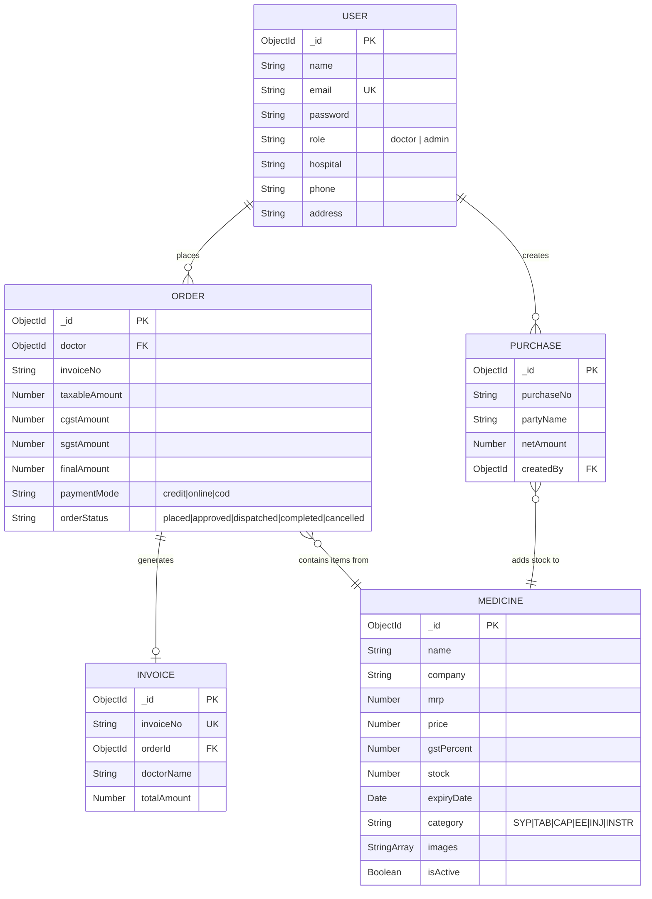
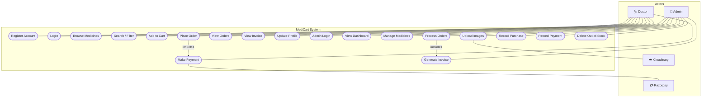
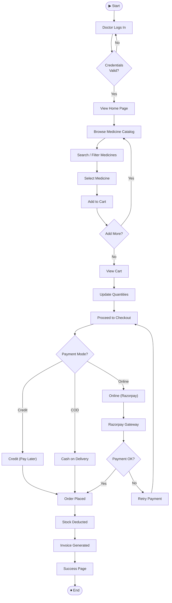
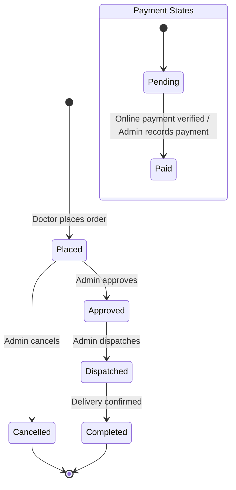
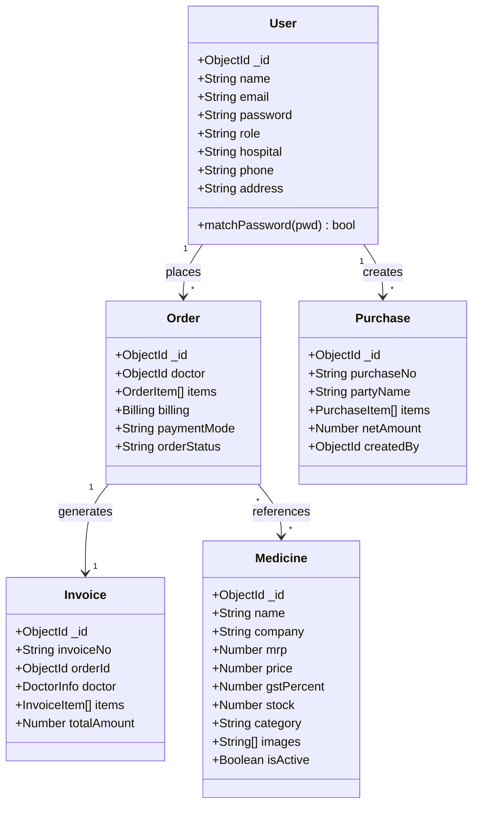
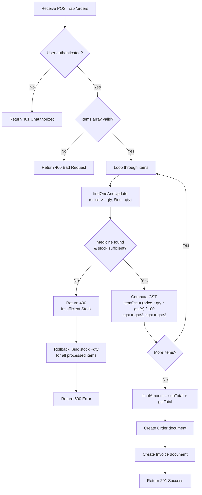
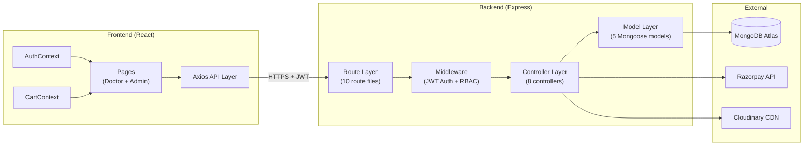
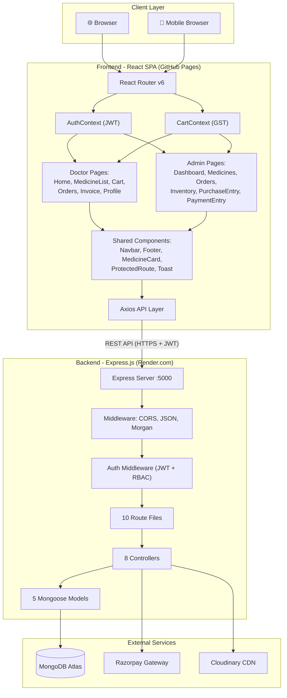

# CHAPTER 4: SYSTEM DESIGN

## 4.1 Basic Modules

MediCart is decomposed into six core modules:

| Module | Description | Access |
|:-------|:------------|:-------|
| **Authentication Module** | Handles doctor registration, doctor/admin login, JWT generation, password hashing | Public |
| **Medicine Management Module** | CRUD operations on medicine catalogue with Cloudinary image uploads | Admin |
| **Order Processing Module** | Cart checkout, GST computation, stock validation, order lifecycle management | Doctor + Admin |
| **Invoice Module** | Automatic invoice generation with GST bifurcation, invoice retrieval | Doctor + Admin |
| **Purchase Entry Module** | Records wholesale purchases from manufacturers, auto-increments stock | Admin |
| **Payment Module** | Razorpay integration, payment verification, payment entry recording | Doctor + Admin |

## 4.2 Data Design

### 4.2.1 Schema Design

MediCart uses MongoDB (NoSQL) with Mongoose ODM. Data is stored in five primary collections with embedded sub-documents for nested structures.

**Table 4.1: User Collection (`users`)**

| Field | Data Type | Constraints |
|:------|:----------|:------------|
| `_id` | ObjectId | Primary Key (auto) |
| `name` | String | Required |
| `email` | String | Required, Unique |
| `password` | String | Required, bcrypt hashed |
| `role` | String | Enum: ["doctor", "admin"], Required |
| `hospital` | String | Optional |
| `phone` | String | Optional |
| `address` | String | Optional |
| `createdAt` | Date | Auto (timestamps) |
| `updatedAt` | Date | Auto (timestamps) |

**Table 4.2: Medicine Collection (`medicines`)**

| Field | Data Type | Constraints |
|:------|:----------|:------------|
| `_id` | ObjectId | Primary Key |
| `name` | String | Required, Trimmed |
| `brand` | String | Default: "" |
| `company` | String | Default: "" |
| `companyCode` | String | Default: "" |
| `itemCode` | String | Default: "" |
| `description` | String | Default: "" |
| `packaging` | String | Default: "" |
| `packing` | String | Default: "" |
| `mrp` | Number | Required, Min: 0 |
| `price` | Number | Required, Min: 0, Default: 0 |
| `cost` | Number | Default: 0, Min: 0 |
| `gstPercent` | Number | Default: 5, Min: 0 |
| `stock` | Number | Required, Default: 0, Min: 0 |
| `expiryDate` | Date | Optional |
| `category` | String | Enum: ["SYP","TAB","CAP","EE","INJ","INSTR"], Default: "TAB" |
| `images` | Array[String] | Cloudinary URLs |
| `isActive` | Boolean | Default: true |

**Table 4.3: Order Collection (`orders`)**

| Field | Data Type | Constraints |
|:------|:----------|:------------|
| `_id` | ObjectId | Primary Key |
| `doctor` | ObjectId | Ref: User, Required |
| `items` | Array[OrderItem] | Embedded sub-documents |
| `invoiceNo` | String | Auto-generated (INV-YYYYMMDD-RAND) |
| `notes` | String | Default: "" |
| `billing.taxableAmount` | Number | Required |
| `billing.cgstAmount` | Number | Required |
| `billing.sgstAmount` | Number | Required |
| `billing.finalAmount` | Number | Required |
| `paymentMode` | String | Enum: ["credit","online","cod"], Required |
| `paymentStatus` | String | Enum: ["pending","paid"], Default: "pending" |
| `paidAmount` | Number | Default: 0 |
| `paymentInfo.razorpay_payment_id` | String | Nullable |
| `paymentInfo.razorpay_order_id` | String | Nullable |
| `adminStatus` | String | Enum: ["pending","completed"], Default: "pending" |
| `orderStatus` | String | Enum: ["placed","approved","dispatched","completed","cancelled"] |

**Table 4.4: Invoice Collection (`invoices`)**

| Field | Data Type | Constraints |
|:------|:----------|:------------|
| `_id` | ObjectId | Primary Key |
| `invoiceNo` | String | Required, Unique |
| `orderId` | ObjectId | Ref: Order, Required |
| `doctor.name` | String | Embedded |
| `doctor.clinic` | String | Embedded |
| `doctor.phone` | String | Embedded |
| `doctor.city` | String | Embedded |
| `items` | Array[InvoiceItem] | Embedded (name, company, packaging, expiry, qty, mrp, price, gstPercent, amount) |
| `taxableAmount` | Number | Computed |
| `sgstAmount` | Number | Computed |
| `cgstAmount` | Number | Computed |
| `igstAmount` | Number | Default: 0 |
| `totalAmount` | Number | Computed |

**Table 4.5: Purchase Collection (`purchases`)**

| Field | Data Type | Constraints |
|:------|:----------|:------------|
| `_id` | ObjectId | Primary Key |
| `purchaseType` | String | Enum: ["CREDIT PURCHASE","CASH PURCHASE"] |
| `purchaseNo` | String | Required |
| `partyCode` | String | Default: "" |
| `partyName` | String | Default: "" |
| `billNo` | String | Default: "" |
| `entryNo` | String | Default: "" |
| `location` | String | Default: "L" |
| `creditDays` | Number | Default: 0 |
| `headerDiscount` | Number | Default: 0 |
| `entryDate` | Date | Default: Date.now |
| `billDate` | Date | Default: Date.now |
| `receivedDate` | Date | Default: Date.now |
| `items` | Array[PurchaseItem] | Embedded (code, itemName, mfr, pkg, batch, exp, mrp, qty, free, billRate, schemePercent, discountPercent, gstPercent, salePrice, hsnCode, taxableAmount, sgst, cgst, amount, imageUrl) |
| `totalQty` | Number | Computed |
| `totalTaxable` | Number | Computed |
| `totalSgst` | Number | Computed |
| `totalCgst` | Number | Computed |
| `totalAmount` | Number | Computed |
| `netAmount` | Number | Computed |
| `createdBy` | ObjectId | Ref: User |

### 4.2.2 Data Integrity and Constraints

1. **Referential Integrity:** Mongoose ObjectId references link Orders to Users and Medicines. The `populate()` method resolves references at query time.
2. **Unique Constraints:** `email` in Users and `invoiceNo` in Invoices are enforced as unique at the database level.
3. **Pre-save Hooks:** The User model uses a Mongoose `pre('save')` hook to automatically hash passwords before persistence.
4. **Atomic Operations:** Stock deduction uses `findOneAndUpdate` with `$gte` guard and `$inc` operator to prevent race conditions.
5. **Default Values:** Critical numeric fields (price, stock, gstPercent) have defaults to prevent NaN propagation.
6. **Enum Validation:** Fields like `role`, `category`, `paymentMode`, `orderStatus` use Mongoose enum validators.

### Figure 4.1: ER Diagram



## 4.3 Procedural Design

### 4.3.1 Logic Diagrams

### Figure 4.2: Use Case Diagram



### Figure 4.3: Activity Diagram — Doctor Order Flow



### Figure 4.4: Sequence Diagram — Order & Payment Flow

```mermaid
sequenceDiagram
    actor Doctor
    participant Frontend as React Frontend
    participant API as Express API
    participant Auth as Auth Middleware
    participant DB as MongoDB
    participant RZP as Razorpay

    rect rgb(30, 40, 60)
    Note over Doctor, Auth: Authentication Phase
    Doctor ->> Frontend: Enter Credentials
    Frontend ->> API: POST /api/auth/doctor/login
    API ->> DB: Find User by Email
    DB -->> API: User Document
    API ->> API: Verify Password (bcrypt)
    API ->> API: Generate JWT Token
    API -->> Frontend: { token, role, user }
    Frontend ->> Frontend: Store in AuthContext
    end

    rect rgb(25, 50, 40)
    Note over Doctor, DB: Browse & Cart Phase
    Doctor ->> Frontend: Browse Medicines
    Frontend ->> API: GET /api/medicines
    API ->> Auth: Verify JWT
    Auth -->> API: req.user set
    API ->> DB: Find Active Medicines (stock > 0)
    DB -->> API: Medicine List
    API -->> Frontend: Medicine Array
    Doctor ->> Frontend: Add items to Cart
    Frontend ->> Frontend: CartContext updates GST
    end

    rect rgb(50, 35, 50)
    Note over Doctor, RZP: Order & Payment Phase
    Doctor ->> Frontend: Place Order (online)
    Frontend ->> API: POST /api/payment/create-order
    API ->> RZP: Create Razorpay Order
    RZP -->> API: razorpay_order_id
    API -->> Frontend: Order Details
    Frontend ->> RZP: Open Checkout
    Doctor ->> RZP: Complete Payment
    RZP -->> Frontend: Payment Callback
    Frontend ->> API: POST /api/payment/verify
    API ->> API: Verify Signature
    API ->> DB: Create Order + Deduct Stock
    API ->> DB: Create Invoice
    API -->> Frontend: { orderId, success }
    Frontend -->> Doctor: Order Success
    end
```



### Figure 4.5: State Transition Diagram



### Figure 4.6: Class Diagram



### Figure 4.7: Logic Flow Diagram — placeOrder()



### Figure 4.8: Collaboration Diagram



### 4.3.2 Data Structures

**Key data structures used in MediCart:**

1. **JWT Payload Object:**
```json
{
  "id": "ObjectId (user._id)",
  "role": "doctor | admin",
  "iat": 1700000000,
  "exp": 1700604800
}
```

2. **Cart Item (Frontend Context):**
```json
{
  "medicineId": "ObjectId",
  "name": "Paracetamol 500mg",
  "price": 45.00,
  "mrp": 52.00,
  "gstPercent": 5,
  "quantity": 10,
  "stock": 200,
  "images": ["https://res.cloudinary.com/..."]
}
```

3. **Order Billing Object (Embedded):**
```json
{
  "taxableAmount": 450.00,
  "cgstAmount": 11.25,
  "sgstAmount": 11.25,
  "finalAmount": 472.50
}
```

### 4.3.3 Algorithms Design

**Algorithm 1: GST Billing Computation**

```
ALGORITHM: ComputeGSTBilling(items[])
INPUT: Array of cart items with {medicineId, quantity}
OUTPUT: Billing object {taxableAmount, cgstAmount, sgstAmount, finalAmount}

BEGIN
    subTotal ← 0
    gstTotal ← 0

    FOR EACH item IN items DO
        medicine ← FindMedicineById(item.medicineId)
        IF medicine.stock < item.quantity THEN
            THROW "Insufficient stock"
        END IF

        price ← medicine.price
        gstPercent ← medicine.gstPercent OR 5

        itemTotal ← price × item.quantity
        itemGst ← (itemTotal × gstPercent) / 100

        subTotal ← subTotal + itemTotal
        gstTotal ← gstTotal + itemGst
    END FOR

    cgstAmount ← ROUND(gstTotal / 2, 2)
    sgstAmount ← ROUND(gstTotal / 2, 2)
    finalAmount ← ROUND(subTotal + gstTotal, 2)

    RETURN { subTotal, cgstAmount, sgstAmount, finalAmount }
END
```

**Algorithm 2: Atomic Stock Deduction with Rollback**

```
ALGORITHM: AtomicStockDeduction(items[])
INPUT: Array of order items
OUTPUT: Updated medicines with deducted stock

BEGIN
    processedItems ← []

    FOR EACH item IN items DO
        result ← MongoDB.findOneAndUpdate(
            { _id: item.medicineId, stock: { $gte: item.quantity } },
            { $inc: { stock: -item.quantity } },
            { new: true }
        )

        IF result IS NULL THEN
            // ROLLBACK all previously processed items
            FOR EACH processed IN processedItems DO
                MongoDB.updateOne(
                    { _id: processed.medicineId },
                    { $inc: { stock: +processed.quantity } }
                )
            END FOR
            THROW "Insufficient stock"
        END IF

        processedItems.PUSH(item)
    END FOR

    RETURN processedItems
END
```

**Algorithm 3: Invoice Number Generation**

```
ALGORITHM: GenerateInvoiceNo()
OUTPUT: Unique invoice string "INV-YYYYMMDD-RAND"

BEGIN
    date ← CurrentDate()
    yyyy ← date.getFullYear()
    mm ← PadStart(date.getMonth() + 1, 2, "0")
    dd ← PadStart(date.getDate(), 2, "0")
    rand ← RandomInteger(1000, 9999)

    RETURN "INV-" + yyyy + mm + dd + "-" + rand
END
```

### 4.3.4 System Architecture

### Figure 4.9: System Architecture Diagram



## 4.4 User Interface Design

MediCart features a modern, responsive UI built with React.js and styled with Tailwind CSS and custom CSS. Key screens include:

**Figure 4.10: Login Interface**
- Clean, centered form with email and password fields
- Role-based routing: Doctor login redirects to Home; Admin login redirects to Dashboard
- Error toasts for invalid credentials
- "Sign Up" link for new doctor registration

**Figure 4.11: Main Dashboard Interface (Admin)**
- Grid layout with analytics cards: Total Orders, Total Revenue, Total Medicines, Low Stock Alerts
- Sidebar navigation to all admin modules
- Recent orders table with status badges
- Responsive design adapts to mobile viewports

**Figure 4.12: Medicine Catalogue (Doctor)**
- Card-based grid layout with MedicineCard components
- Each card displays: product image (from Cloudinary), company name, packaging, MRP, discounted price, stock indicator
- Interactive "Add to Cart" button with quantity counter
- Real-time search bar and category filter dropdown

**Figure 4.13: Shopping Cart & Checkout**
- Detailed item list with quantity adjusters (+/−)
- Real-time computation of Taxable Amount, CGST, SGST, and Final Amount
- Payment mode selector (Online / COD / Credit)
- Order notes field
- Razorpay popup integration for online payments

**Figure 4.14: Admin Order Management**
- Paginated table of all orders with doctor name, date, amount, payment mode/status
- Status dropdown for order lifecycle transitions
- Payment status toggle
- Invoice view link for each order

**Figure 4.15: Admin Inventory Management**
- Add Medicine form with all fields + multi-image upload
- Editable medicine table with inline actions
- Bulk delete out-of-stock button
- Stock level indicators (green/yellow/red)

**Figure 4.16: Purchase Entry Form**
- Comprehensive form capturing party details, bill info, dates, credit days
- Dynamic item rows with fields: item name, manufacturer, batch, expiry, MRP, qty, bill rate, scheme%, discount%, GST%, HSN code
- Auto-calculation of taxable amount, SGST, CGST, and total per item
- Grand total summary at bottom

**Figure 4.17: Invoice View**
- Printer-friendly layout mimicking a formal GST Tax Invoice
- Header with distributor details and invoice number
- Doctor details section
- Itemised table with MRP, price, qty, GST%, and amount
- Tax summary: Taxable Amount, CGST, SGST, Grand Total
- Download as PDF option

## 4.5 Security Issues

| Threat | Mitigation |
|:-------|:-----------|
| **Password Theft** | Passwords hashed with bcryptjs (salt factor 10) via Mongoose pre-save hook; never stored in plain text |
| **Unauthorised API Access** | JWT-based authentication middleware on all protected routes; tokens expire after 7 days |
| **Privilege Escalation** | Role-based access control (RBAC) middleware checks `req.user.role` before allowing admin routes |
| **Payment Tampering** | Server-side Razorpay signature verification using HMAC-SHA256; payment amounts computed on backend, not trusted from client |
| **Injection Attacks** | Mongoose schema validation and parameterised queries prevent NoSQL injection; input trimming on all string fields |
| **CORS Abuse** | Strict CORS whitelist allowing only production (orbitdad.github.io) and localhost origins |
| **Secret Exposure** | All sensitive keys (JWT_SECRET, MONGO_URI, RAZORPAY_KEY_SECRET, CLOUDINARY credentials) stored in `.env` files, excluded from version control |
| **Session Hijacking** | Stateless JWT architecture eliminates server-side session storage; HTTPS enforced in production |

## 4.6 Test Cases Design

| TC ID | Module | Test Scenario | Expected Result | Status |
|:------|:-------|:--------------|:----------------|:-------|
| TC-01 | Auth | Doctor login with valid credentials | JWT issued, redirected to Home | Pass |
| TC-02 | Auth | Doctor login with wrong password | 401 error, "Invalid credentials" | Pass |
| TC-03 | Auth | Doctor signup with duplicate email | 400 error, "Email already exists" | Pass |
| TC-04 | Auth | Doctor accesses admin route | 403 Forbidden | Pass |
| TC-05 | Medicine | Admin adds medicine with all fields + image | Medicine created, image on Cloudinary | Pass |
| TC-06 | Medicine | Admin edits medicine price and stock | Fields updated correctly | Pass |
| TC-07 | Medicine | Admin deletes a medicine | Medicine removed from DB | Pass |
| TC-08 | Medicine | Doctor searches medicines by name | Filtered results returned | Pass |
| TC-09 | Cart | Doctor adds item with qty > stock | UI prevents exceeding stock | Pass |
| TC-10 | Cart | Doctor updates quantity in cart | GST recalculated in real-time | Pass |
| TC-11 | Order | Doctor places COD order | Order created, status "placed", payment "pending" | Pass |
| TC-12 | Order | Doctor places online order via Razorpay | Payment verified, order created, status "paid" | Pass |
| TC-13 | Order | Doctor places credit order | Order created, payment "pending" | Pass |
| TC-14 | Order | Order placed when stock = 0 | 400 error, "Insufficient stock" | Pass |
| TC-15 | Order | Order fails mid-processing | Stock rolled back for all items | Pass |
| TC-16 | Invoice | Invoice generated on order placement | Invoice with correct GST breakup | Pass |
| TC-17 | Invoice | Doctor views invoice for completed order | Invoice displayed with all details | Pass |
| TC-18 | Admin | Admin updates order status to "dispatched" | orderStatus field updated | Pass |
| TC-19 | Admin | Admin marks order as completed | adminStatus set to "completed" | Pass |
| TC-20 | Purchase | Admin records purchase entry | Purchase saved, stock incremented | Pass |
| TC-21 | Purchase | Purchase entry with GST computation | Correct SGST, CGST, total calculated | Pass |
| TC-22 | Payment | Admin records payment against order | paidAmount updated, paymentStatus = "paid" | Pass |
| TC-23 | GST | Order with 5% GST item (price 100, qty 2) | Taxable=200, CGST=5, SGST=5, Total=210 | Pass |
| TC-24 | Security | Expired JWT token used | 401 Unauthorized | Pass |
| TC-25 | Security | Request without Authorization header | 401 Unauthorized | Pass |
| TC-26 | UI | Mobile viewport (360×640) | Layout responsive, no overflow | Pass |
| TC-27 | UI | Image upload to Cloudinary | URL saved, image visible | Pass |
| TC-28 | Inventory | Admin bulk-deletes out-of-stock medicines | All medicines with stock=0 deleted | Pass |
| TC-29 | Dashboard | Admin views dashboard | Correct totals for orders, revenue, medicines | Pass |
| TC-30 | Profile | Doctor updates profile | Name, hospital, phone updated | Pass |
