# All Diagrams from MediCart_Complete_BlackBook.docx

## Diagram 1

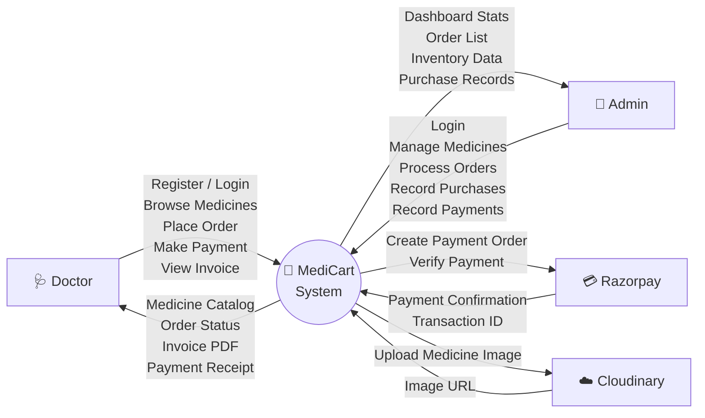

## Diagram 2

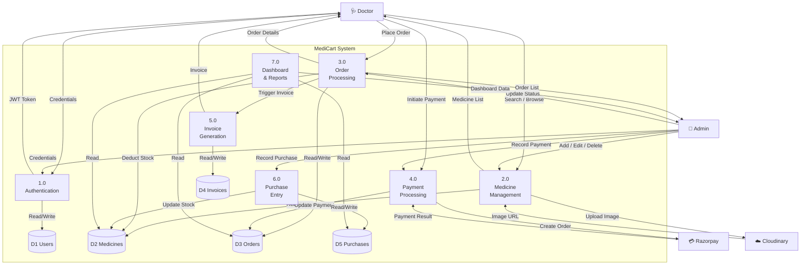

## Diagram 3

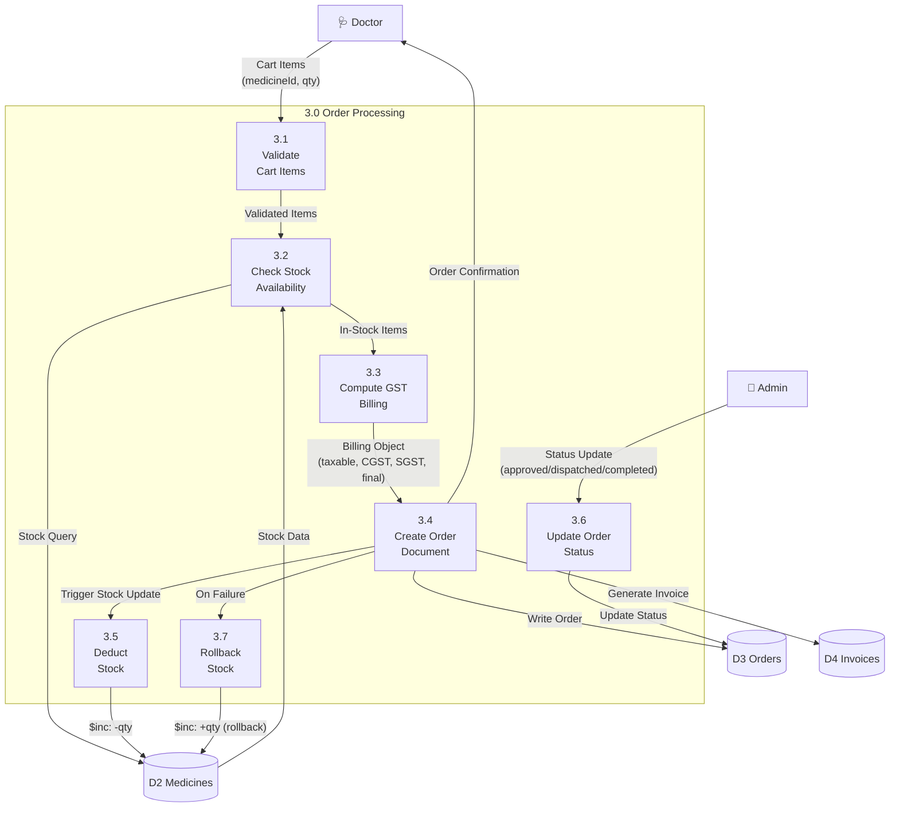

## Diagram 4

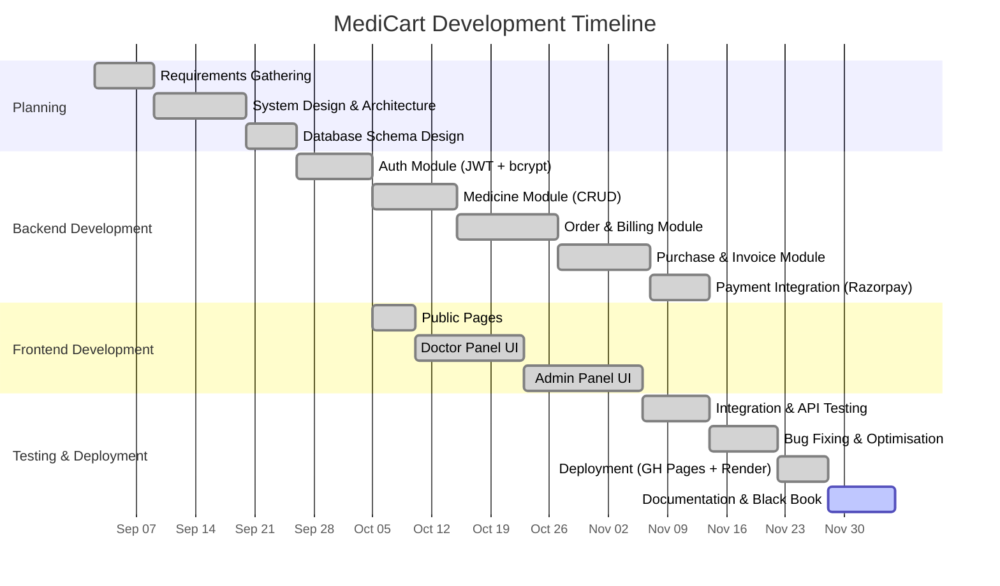

## Diagram 5

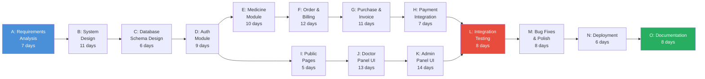

## Diagram 6

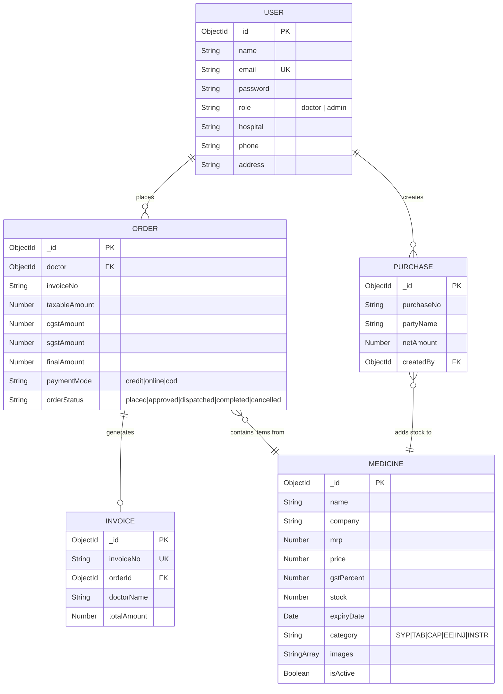

## Diagram 7

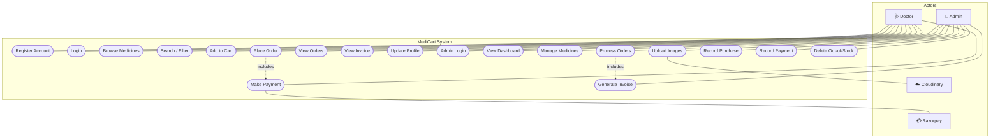

## Diagram 8

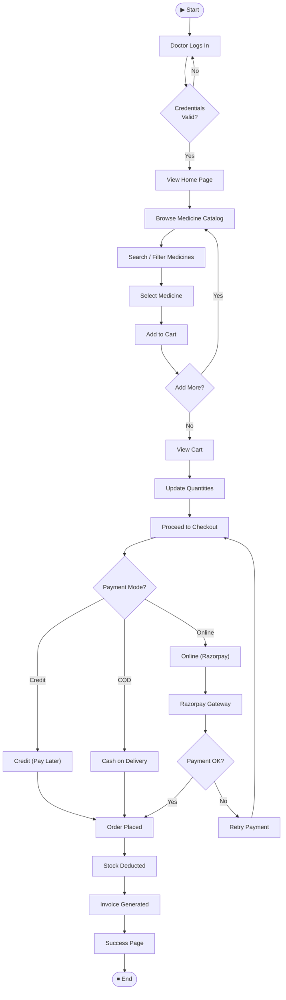

## Diagram 9

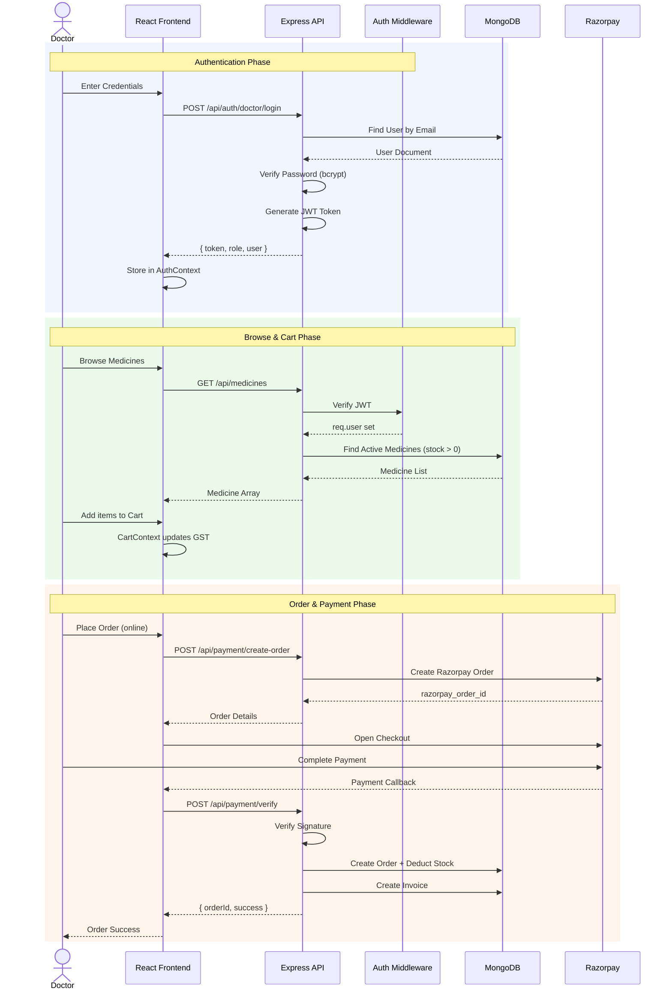

## Diagram 10

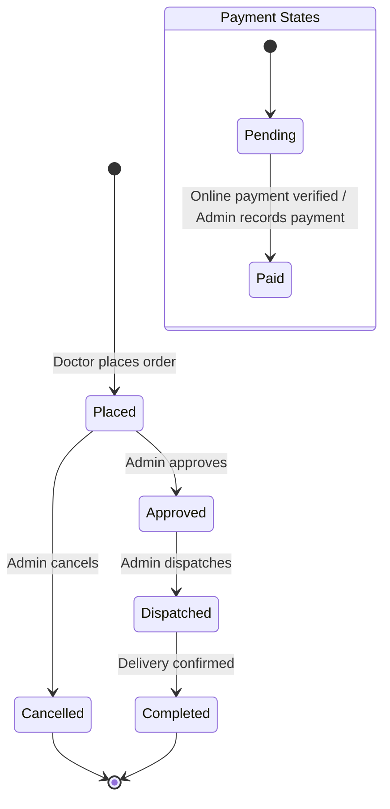

## Diagram 11

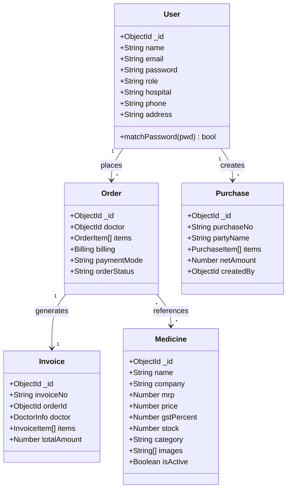

## Diagram 12

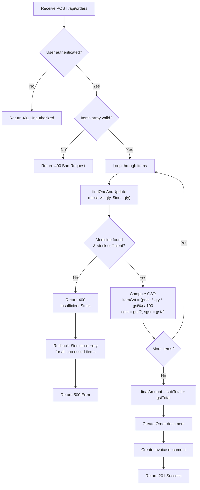

## Diagram 13

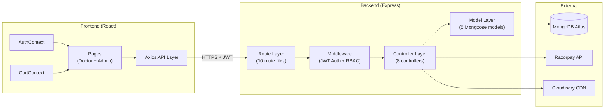

## Diagram 14

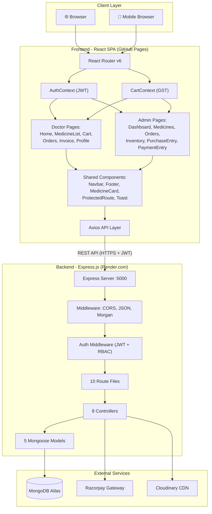

