# 📋 MediCart — Complete Software Engineering Diagrams

All diagrams below are generated from the actual MediCart codebase analysis.

---

## 1. Gantt Chart — Project Development Timeline

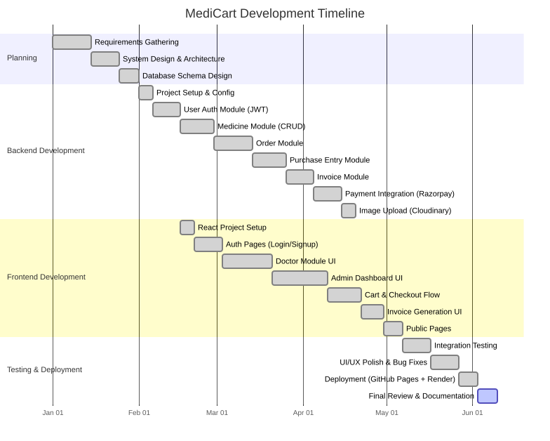

---

## 2. Data Flow Diagram — Level 0 (Context Diagram)


---

## 3. Data Flow Diagram — Level 1


---

## 4. Use Case Diagram


---

## 5. ER Diagram (Entity Relationship Diagram)


---

## 6. Database Schema Diagram


> [!NOTE]
> ★ = required field. `→` denotes a foreign key reference. Subdocuments (OrderItem, Billing, PaymentInfo, PurchaseItem, InvoiceItem) are embedded within their parent documents (MongoDB style).

---

## 7. System Architecture Diagram


---

## 8. Activity Diagram — Doctor Order Placement Flow


---

## 9. Sequence Diagram — Order & Payment Flow

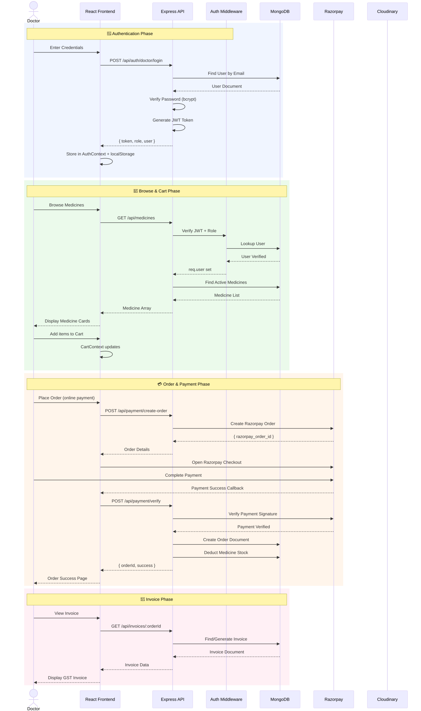

---

## 10. PERT Chart — Project Task Dependencies


> [!IMPORTANT]
> **Critical Path**: A → B → C → D → E → F → G → H → I → J → K → S → T → U → V (total ≈ 143 days)

---

## 11. Flowchart — Complete System Workflow


---

> [!TIP]
> All diagrams are rendered using **Mermaid.js** syntax. They can be exported to PNG/SVG using tools like [mermaid.live](https://mermaid.live), or rendered directly in GitHub, VS Code (with Mermaid extension), or documentation tools like Notion/Confluence.
